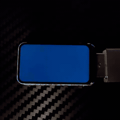
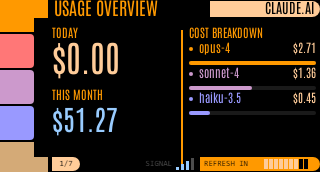
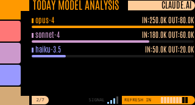
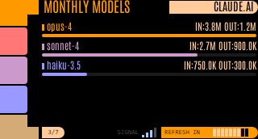
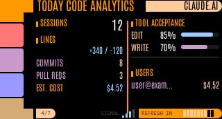
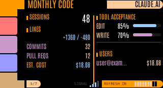
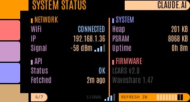
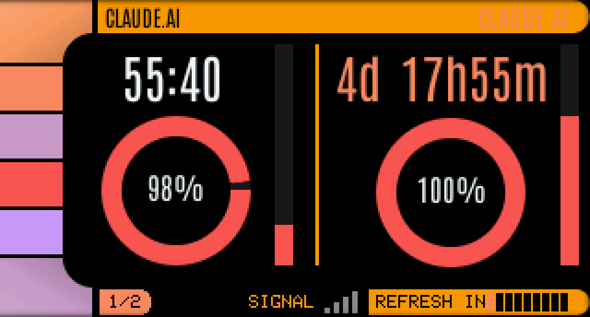
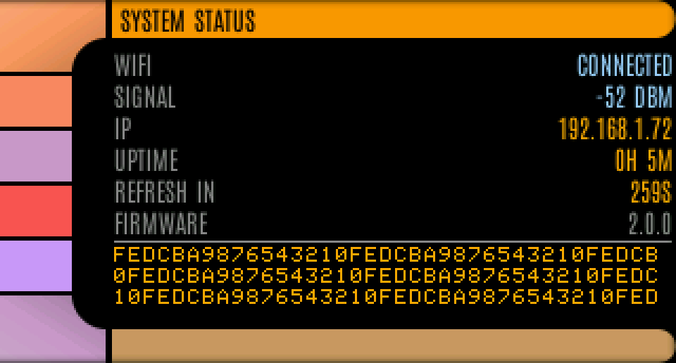

# ClaudeGauge

A real-time AI usage monitor — a tiny desk gadget that shows your Claude API costs, token usage, rate limits, and Claude.ai subscription status on an LCARS-inspired Star Trek display.

**Get a pre-built device:** [claudegauge.com](https://claudegauge.com)



**Firmware v1 — Full Dashboard (7 screens)**

 

**Firmware v2 — Claude.ai Focus (3 screens)**



## What It Monitors

- **API costs** — today and month-to-date spend in USD
- **Token usage** — input, output, cached, and cache-write tokens with per-model breakdown
- **Claude Code analytics** — sessions, commits, PRs, lines changed, acceptance rates
- **Claude.ai subscription** — 5-hour and 7-day rate limits with countdown timers
- **System status** — WiFi, heap, uptime, firmware version

## Supported Boards

| Board | Display | Interface | Buy |
|-------|---------|-----------|-----|
| [LILYGO T-Display-S3](https://amzn.to/3NcILx0) | 1.9" 320x170 (parallel) | USB-C, 2 buttons, touch | [Amazon](https://amzn.to/3NcILx0) |
| [Waveshare ESP32-S3-LCD-1.47](https://amzn.to/4cgtg1k) | 1.47" 320x172 (SPI) | USB-A, 1 button | [Amazon](https://amzn.to/4cgtg1k) |

## Project Structure

```
firmware/          Standalone ESP32 firmware (v1 — 7 dashboard screens)
firmware-v2/       Firmware built on lcars-esp32 engine (v2 — modular, 3 screens)
designer/          LCARS WYSIWYG layout editor (works with both firmware versions)
extension/         Chrome extension for one-click Claude.ai session key setup
cloud-proxy/       Vercel Edge Function proxy (ESP32 -> Claude.ai)
scripts/           Build utilities
```

### Firmware Versions

| | v1 (`firmware/`) | v2 (`firmware-v2/`) |
|---|---|---|
| **Screens** | 7 (Overview, Models, Code, Claude.ai, Status) | 3 (Claude.ai, Status, Setup) |
| **Architecture** | Standalone, all-in-one | Built on [lcars-esp32](https://github.com/dorofino/lcars-esp32) engine |
| **Dependencies** | TFT_eSPI + ArduinoJson | TFT_eSPI + ArduinoJson + lcars-esp32 |
| **Best for** | Full dashboard experience | Focused Claude.ai monitoring |

Both versions support both boards and can be selected in the LCARS Designer.

---

## Quick Start

### Prerequisites

- [PlatformIO](https://platformio.org/) (CLI or VS Code extension)
- A supported ESP32-S3 board (see table above)
- Anthropic API key (admin key recommended for full usage/cost data)

### Build & Flash

```bash
# Clone the repository
git clone https://github.com/dorofino/claudegauge.git
cd claudegauge

# --- Firmware v1 (7 screens, standalone) ---
cd firmware
pio run -e tdisplays3              # Build for LILYGO T-Display-S3
pio run -e waveshare147            # Build for Waveshare ESP32-S3-LCD-1.47
pio run -e tdisplays3 -t upload    # Build and flash

# --- Firmware v2 (lcars-esp32 engine) ---
cd firmware-v2
pio run -e tdisplays3              # Build for LILYGO
pio run -e waveshare147            # Build for Waveshare
pio run -e tdisplays3 -t upload    # Build and flash
```

PlatformIO will automatically download all dependencies (TFT_eSPI, ArduinoJson, and lcars-esp32 for v2).

### First-Time Setup

1. Power on the device — it enters **Setup Mode** automatically
2. Connect your phone/laptop to the WiFi network `ClaudeGauge-XXXX`
3. A captive portal opens (or navigate to `192.168.4.1`)
4. Enter your WiFi credentials and Anthropic API key
5. [Deploy the cloud proxy](#cloud-proxy) and enter the URL in the **Cloud Proxy** step
6. Add your Claude.ai session key (or install the [Chrome extension](#chrome-extension) for one-click setup)
7. The device reboots, connects to WiFi, and starts displaying data

### API Key Requirements

| Key Type | Usage & Cost Data | Claude Code Data |
|----------|:-:|:-:|
| Admin key (`sk-ant-admin01-...`) | Yes | Yes |
| Regular key (`sk-ant-api...`) | Limited | No |

An **admin API key** is recommended for full access to usage reports, cost data, and Claude Code analytics.

---

## LCARS Designer

A browser-based WYSIWYG editor for customizing the screen layouts on your device. What you see in the editor is exactly what renders on the ESP32.

```bash
cd designer
python server.py
# Open http://localhost:8080
```

Features:
- Drag-and-drop element positioning
- Live preview with accurate font rendering
- Switch between firmware v1 and v2
- Build and upload directly to your device
- Generates C++ header files automatically

The designer requires Python 3 (stdlib only, no pip packages needed).

---

## Chrome Extension

The Chrome extension lets you send your Claude.ai session key to the device with one click — no need to open DevTools and copy cookies manually.

### Install from Source

1. Open `chrome://extensions/`
2. Enable **Developer mode**
3. Click **Load unpacked** and select the `extension/` folder
4. Click the ClaudeGauge icon while on `claude.ai` to send your session key

See [extension/STORE_LISTING.md](extension/STORE_LISTING.md) for details.

---

## Cloud Proxy

The ESP32 cannot connect directly to `claude.ai` because Cloudflare blocks the mbedTLS TLS fingerprint. A lightweight Vercel Edge Function acts as a proxy.

### Deploy Your Own Proxy

```bash
cd cloud-proxy
npx vercel          # Follow prompts to deploy
npx vercel --prod   # Deploy to production
```

Then set the proxy URL on your device via the web portal at `http://<device-ip>/`.

The proxy is a stateless relay — it forwards requests from the ESP32 to claude.ai with browser-like headers. Your session key is passed via the `X-Session-Key` header and never stored.

---

## Dashboard Screens (Firmware v1)

Navigate screens with the buttons. Long-press to force a data refresh.

| # | Screen | Description |
|---|--------|-------------|
| 1 | **Usage Overview** | Today's cost, monthly cost, and token usage bars |
| 2 | **Today Model Analysis** | Per-model token breakdown for the current day |
| 3 | **Monthly Models** | Per-model breakdown for the current month |
| 4 | **Today Code Analytics** | Claude Code sessions, lines changed, commits, PRs |
| 5 | **Monthly Code** | Month-to-date Claude Code analytics |
| 6 | **Claude.ai Subscription** | Rate limits with donut gauges and countdown timers |
| 7 | **System Status** | WiFi, API status, heap/PSRAM, uptime, firmware version |

## Button Controls

**LILYGO T-Display-S3 (2 buttons):**
- Left button: Previous screen
- Right button: Next screen
- Right long press: Force refresh

**Waveshare ESP32-S3-LCD-1.47 (1 button):**
- Short press: Next screen (cycles)
- Long press: Force refresh

---

## Adding a New Board

1. Create a board JSON in `firmware/boards/` (if no PlatformIO definition exists)
2. Add a new `[env:boardname]` in `platformio.ini` with TFT_eSPI display flags
3. Add board-specific pins and feature flags in `include/pin_config.h`
4. Build with `pio run -e boardname`

Feature flags (`HAS_TWO_BUTTONS`, `HAS_POWER_PIN`, `HAS_TOUCH`) control conditional compilation — the application code adapts automatically.

---

## Troubleshooting

| Symptom | Fix |
|---------|-----|
| Stuck on setup screen | Connect to `ClaudeGauge-XXXX` AP and configure WiFi/API key |
| "API ERROR" | Invalid or expired API key — reconfigure via web portal |
| "HTTP 403" | Key lacks admin permissions — use an admin key |
| No Claude Code data | Requires admin key with Claude Code enabled |
| Claude.ai "No proxy URL configured" | Deploy the cloud proxy and enter the URL in the web portal |
| Claude.ai "NOT CONFIGURED" | Install Chrome extension or paste session key in web portal |
| Claude.ai "Session expired" | Log into claude.ai again and re-send via extension |
| Display is dim | Auto-dim is active — press any button to wake |
| Waveshare won't flash | Hold BOOT, press RESET, release BOOT, then upload |

To factory reset, access the web portal at the device's IP and click **Reset All Settings**.

---

## Documentation

- [firmware/ARCHITECTURE.md](firmware/ARCHITECTURE.md) — Component documentation and data flow
- [firmware/CONFIGURATION.md](firmware/CONFIGURATION.md) — Full configuration guide
- [firmware/HARDWARE.md](firmware/HARDWARE.md) — Board pinouts and wiring details
- [extension/PRIVACY_POLICY.md](extension/PRIVACY_POLICY.md) — Chrome extension privacy policy

## Contributing

This is an active project and contributions are always welcome! Whether it's adding support for a new board, building new dashboard screens, improving the designer, or fixing bugs — we'd love your help.

- **Fork and PR** — the standard GitHub flow
- **Issues** — report bugs or suggest features via GitHub Issues
- **New boards** — see [Adding a New Board](#adding-a-new-board) above
- **Screen layouts** — use the LCARS Designer to create and share custom layouts

## Don't Want to Build?

Visit [claudegauge.com](https://claudegauge.com) to get a pre-built ClaudeGauge device, ready to use out of the box.

## License

MIT License. See [LICENSE](LICENSE) for details.
