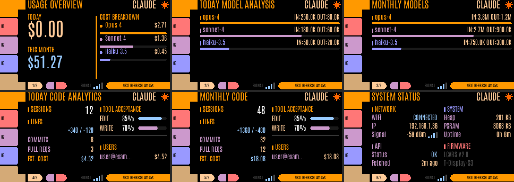

# ClaudeGauge

A real-time API usage dashboard for Anthropic's Claude API, running on ESP32-S3 boards with an LCARS-inspired Star Trek TNG interface.



## Features

- **Cost tracking** — Today and month-to-date API spend in USD
- **Token breakdown** — Input, output, cached, and cache-write tokens with proportional bars
- **Model analysis** — Per-model usage breakdown (daily and monthly)
- **Claude Code analytics** — Sessions, commits, PRs, lines changed, edit/write acceptance rates
- **Claude.ai subscription tracking** — 5-hour and 7-day rate limits with donut gauges and countdown timers
- **Chrome extension** — One-click session key setup (no DevTools needed)
- **7 dashboard screens** navigable via physical buttons
- **Auto-refresh** every 5 minutes with manual force-refresh
- **Web configuration portal** — Captive portal AP for WiFi and API key setup
- **Auto-dim backlight** after 2 minutes of inactivity
- **LCARS aesthetic** — Authentic Star Trek TNG color palette with anti-aliased custom fonts

## Supported Boards

| | LILYGO T-Display-S3 | Waveshare ESP32-S3-LCD-1.47 |
|---|---|---|
| **Display** | 1.9" ST7789V, 170x320, 8-bit parallel | 1.47" ST7789, 172x320, SPI |
| **MCU** | ESP32-S3 (dual-core, 240 MHz) | ESP32-S3R8 (dual-core, 240 MHz) |
| **Memory** | 16 MB flash, 8 MB PSRAM | 16 MB flash, 8 MB PSRAM |
| **Buttons** | 2 (GPIO 0 + GPIO 14) | 1 (GPIO 0 BOOT only) |
| **Touch** | CST816S capacitive (I2C) | None |
| **Connectivity** | WiFi 802.11 b/g/n | WiFi 802.11 b/g/n |
| **USB** | USB-C | USB Type-A |
| **Extras** | — | RGB LED (GPIO 38), SD card slot |
| **PIO Environment** | `tdisplays3` | `waveshare147` |

See [HARDWARE.md](HARDWARE.md) for pinout and wiring details.

## Quick Start

### Prerequisites

- [PlatformIO](https://platformio.org/) (CLI or VS Code extension)
- A supported ESP32-S3 board (see table above)
- Anthropic API key (admin key recommended for full usage/cost data)

### Build & Flash

```bash
# Clone the repository
git clone https://github.com/dorofino/claudegauge.git
cd claudegauge

# Build for your board
pio run -e tdisplays3       # LILYGO T-Display-S3
pio run -e waveshare147     # Waveshare ESP32-S3-LCD-1.47

# Upload to your board
pio run -e tdisplays3 -t upload
pio run -e waveshare147 -t upload

# Monitor serial output
pio device monitor -b 115200
```

Or use the interactive upload script (Windows):

```powershell
.\scripts\upload.ps1
```

### First-Time Setup

1. Power on the device — it enters **Setup Mode** automatically
2. Connect your phone/laptop to the WiFi network `ClaudeGauge-XXXX`
3. A captive portal opens automatically (or navigate to `192.168.4.1`)
4. Enter your WiFi credentials and Anthropic API key
5. (Optional) Install the [Chrome extension](../extension/) for one-click Claude.ai session key setup
6. The device reboots, connects to WiFi, and starts displaying data

See [CONFIGURATION.md](CONFIGURATION.md) for the full configuration guide.

## Dashboard Screens

Navigate screens with the buttons. Long-press to force a data refresh.

| # | Screen | Description |
|---|--------|-------------|
| 1 | **Usage Overview** | Today's cost (large), monthly cost, and token usage bars (input/output/cached/writes) |
| 2 | **Today Model Analysis** | Per-model token breakdown with proportional bars for the current day |
| 3 | **Monthly Models** | Same model breakdown aggregated for the current month |
| 4 | **Today Code Analytics** | Claude Code metrics: sessions, lines changed, commits, PRs, tool acceptance rates, per-user costs |
| 5 | **Monthly Code** | Month-to-date Claude Code analytics |
| 6 | **Claude.ai Subscription** | 5-hour and 7-day rate limits with donut gauges, countdown timers, and per-model breakdowns |
| 7 | **System Status** | WiFi status, IP, signal strength, API status, heap/PSRAM, uptime, firmware version |

## Button Controls

### LILYGO T-Display-S3 (2 buttons)

| Action | Function |
|--------|----------|
| Left button press | Previous screen |
| Right button press | Next screen |
| Right button long press (>800ms) | Force data refresh |
| Any button press | Wake from dimmed backlight |

### Waveshare ESP32-S3-LCD-1.47 (1 button)

| Action | Function |
|--------|----------|
| BOOT button short press | Next screen (cycles forward) |
| BOOT button long press (>800ms) | Force data refresh |
| Any button press | Wake from dimmed backlight |

## API Key Requirements

| Key Type | Usage & Cost Data | Claude Code Data |
|----------|:-:|:-:|
| Admin key (`sk-ant-admin01-...`) | Yes | Yes |
| Regular key (`sk-ant-api...`) | Limited | No |

An **admin API key** is recommended for full access to organization usage reports, cost data, and Claude Code analytics.

## Project Structure

```
├── src/                        Source code
│   ├── main.cpp                Application entry, state machine, main loop
│   ├── api_client.cpp/.h       Anthropic API HTTPS client
│   ├── claude_ai_client.cpp/.h Claude.ai session client (via cloud proxy)
│   ├── json_parser.cpp/.h      ArduinoJson response parsing
│   ├── wifi_manager.cpp/.h     WiFi connection management
│   ├── time_manager.cpp/.h     NTP synchronization, date formatting
│   ├── display_manager.cpp/.h  TFT display init, sprite buffer, backlight
│   ├── button_handler.cpp/.h   Debounced button input (semantic API)
│   ├── touch_handler.cpp/.h    Capacitive touch (T-Display-S3 only)
│   ├── ui_renderer.cpp/.h      Screen drawing logic (7 screens)
│   ├── ui_widgets.cpp/.h       Reusable UI components (bars, labels, frames)
│   ├── settings_manager.cpp/.h NVS credential storage
│   └── web_server.cpp/.h       Configuration web portal + captive portal
│
├── include/                    Headers and assets
│   ├── config.h                Timing constants, API host, intervals
│   ├── data_models.h           Core data structures (AppState, UsageData, etc.)
│   ├── pin_config.h            Board-conditional GPIO definitions
│   ├── colors.h                LCARS RGB565 color palette
│   ├── smooth_font_*.h         Pre-compiled VLW font data (12/18/28/36px)
│   └── lcars_font_*.h          LCARS-specific font variants
│
├── boards/                     Custom PlatformIO board definitions
│   └── waveshare_esp32s3_lcd147.json
│
├── tools/                      Development utilities
│   ├── create_smooth_fonts.py  TTF → VLW font header converter
│   ├── preview.py              UI mockup screenshot generator
│   └── Antonio.ttf             Source font file
│
├── Images/                     Hardware reference photos
└── platformio.ini              Multi-board build configuration
```

See [ARCHITECTURE.md](ARCHITECTURE.md) for detailed component documentation and data flow.

## Configuration Constants

Key parameters in `include/config.h`:

| Constant | Default | Description |
|----------|---------|-------------|
| `REFRESH_INTERVAL_MS` | 300000 (5 min) | Data fetch interval |
| `NTP_SYNC_INTERVAL_MS` | 3600000 (1 hr) | NTP re-sync interval |
| `DIM_TIMEOUT_MS` | 120000 (2 min) | Backlight auto-dim delay |
| `BACKLIGHT_FULL` | 255 | Full brightness PWM value |
| `BACKLIGHT_DIM` | 40 | Dimmed brightness PWM value |
| `WIFI_TIMEOUT_MS` | 15000 (15 sec) | WiFi connection timeout |
| `CLAUDEAI_DEFAULT_PROXY_URL` | (see config.h) | Default cloud proxy for Claude.ai requests |

## Dependencies

| Library | Version | Purpose |
|---------|---------|---------|
| [TFT_eSPI](https://github.com/Bodmer/TFT_eSPI) | ^2.5.43 | Display driver and graphics |
| [ArduinoJson](https://github.com/bblanchon/ArduinoJson) | ^7.3.0 | JSON response parsing |

Both are managed automatically by PlatformIO.

## Development Tools

### Font Conversion

Custom fonts are pre-compiled from `Antonio.ttf` into VLW format headers using PIL:

```bash
cd tools
python create_smooth_fonts.py
```

This generates `smooth_font_*.h` files with glyph metrics and alpha bitmaps for anti-aliased rendering on the TFT display.

### UI Preview

Generate mockup screenshots of each dashboard screen:

```bash
cd tools
python preview.py
```

### Auth Switcher (Windows)

Switch Claude Code between API key and OAuth authentication:

```powershell
.\scripts\switch-to-api-key.ps1
```

## Serial Monitor

Connect at 115200 baud to see diagnostic output:

```
=== ClaudeGauge v1.0 ===
Configuration found. Connecting...
WiFi connected: 192.168.1.36
NTP synced
--- Fetching data ---
Fetching usage report...
Usage: 125000 input, 45200 output, 89100 cached
Fetching today's cost...
Today's cost: $0.00
Fetching monthly cost...
Monthly cost: $51.27
--- Fetch complete ---
Dashboard mode active.
```

## Troubleshooting

| Symptom | Cause | Fix |
|---------|-------|-----|
| Device stays on setup screen | No WiFi credentials saved | Connect to the `ClaudeGauge-XXXX` AP and configure |
| "API ERROR" on overview screen | Invalid or expired API key | Reconfigure via web portal (device IP in browser) |
| "HTTP 403" on status screen | Key lacks admin permissions | Use an admin key (`sk-ant-admin01-...`) |
| "HTTP 429" on status screen | Rate limited | Wait for the next auto-refresh cycle |
| No Claude Code data | Endpoint not available for key type | Requires admin key with Claude Code enabled |
| Claude.ai "NOT CONFIGURED" | No session key set | Install Chrome extension or manually paste session key in web portal |
| Claude.ai "Session expired" | Session key is stale | Log into claude.ai again and re-send session key via extension |
| WiFi keeps disconnecting | Weak signal or wrong password | Move closer to router, verify credentials |
| Display is dim | Auto-dim activated | Press any button to wake |
| Waveshare won't flash | Board not in download mode | Hold BOOT, press RESET, release BOOT, then upload |
| Crash loop on Waveshare | Wrong board definition | Ensure custom board JSON with 16MB flash + 8MB OPI PSRAM |

To factory reset, access the web portal at the device's IP address and click **Reset All Settings**, or re-flash the firmware.

## Adding a New Board

To add support for another ESP32-S3 board:

1. Create a board JSON in `boards/` (if no PlatformIO definition exists)
2. Add a new `[env:boardname]` in `platformio.ini` with TFT_eSPI display flags
3. Add board-specific pins and feature flags in `include/pin_config.h`
4. Build with `pio run -e boardname`

Feature flags (`HAS_TWO_BUTTONS`, `HAS_POWER_PIN`, `HAS_TOUCH`) control conditional compilation — the application code adapts automatically.

## License

This project is provided as-is for personal and educational use.
